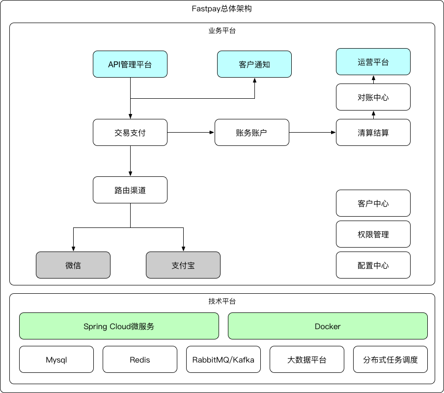

# Fastpay

Fastpay的目标是打造一款开源的、轻量级的、微服务化的、可共私有云部署的、可定制化的集成聚合支付和资金清结算于一体的统一支付系统，满足互联网企业业务系统的收款和资金处理等需求。 

以龙果支付为基础，构建的统一支付系统聚合微信支付宝的扫码、被扫，H5等支付方式，并提供账务和企业资金处理能力，拟分解为：API管理，支付核心，路由渠道，账务账户，清结算、对账中心，商户平台，运营平台，商户通知，分布式任务调度系统，配置系统，客户系统，使用Spring Cloud进行微服务化，可公有云部署亦可私有云部署，提供完备的架构和设计文档、开发文档、API文档和商户/用户向导，并且配合《支付平台架构》一书出版。

感兴趣的小伙伴可以加入我们，为开源事业贡献一份力量，在这里可以学习高大上的支付业务，也可以学习微服务再支付平台的落地，更可以和各位服务架构的作者们一起写作《支付平台架构》一书。

## 业务价值

在国内，网民已经超过6亿人口，其中有至少5亿人口在使用移动支付，因此，对移动支付的需求非常强烈，当前的移动支付入口由微信和支付宝占有，用户已经习惯了使用微信和支付宝来付款，中小型电商等公司有支付需求，当前只能对接完微信后再对接支付宝，其成本高昂，实施周期长，我们这里算一笔账，假设一个电商公司成立统一支付组，共需要5人，3人开发，1人测试，1个产品，一年的投入不下于100万，如果有成熟的开源产品，或者有成熟的云平台，帮助电商公司等进行收款以及附加的资金处理等，对于企业来讲那将是乐此不彼。

## 技术亮点

1. 在支付系统上实施微服务架构，使用最流行的Spring Cloud做服务化。
2. 设计天生可伸缩的数据存储，直接使用分库分表。
3. 使用缓存进行加速交易过程，提高用户体验。
4. 将回调通知、入账等异步化，提高用户响应能力。
5. 使用分布式定时任务系统将任务调度与交易隔离。
6. 使用当前最先进的单元化架构实现可水平伸缩。
7. 有完善的文档，最后配合项目出版《支付平台架构》一书，作为统一支付的白皮书。
8. 通过技术手段构建一站式可定制化的企业支付平台。

## 总体计划

1. 修改龙果支付的关键字为fastpay，并运行起来跑在公网。
2. 架构设计，拆分模块，各个模块之间的关系，模块的职责的定义。
3. 模块设计。
4. 编码实现。
5. 持续优化。 

第1步替换方法：

针对文件内容和针对文件全路径替换：roncoo -> fast    Roncoo -> Fast RONCOO -> FAST

## 总体架构

## 饮水思源

目前以龙果支付为基础，虽然处于初级阶段，但是我们对整个实施的过程和思路都是非常清晰的，我们后续会梳理龙果支付的项目代码，进行微服务化，当前可参考龙果支付的演示页面：

在线支付演示：http://demo.pay.roncoo.com

## 加入项目

加入项目请关注云时代架构公众号，后台回复"+fastpay"，然后，提供微信、github账户号等。

 

 

